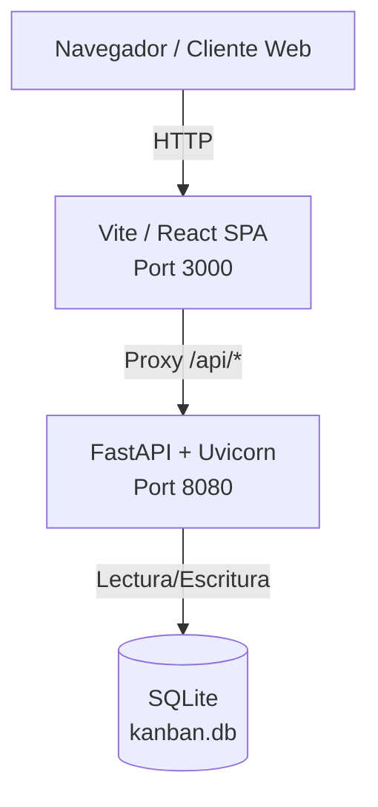

# IT Kanban Board OS (v5)

Plataforma de gestión de tareas y flujos de trabajo (Kanban) diseñada específicamente para la gerencia de sistemas y soporte tecnológico. Permite la visualización de estados, asignación departamental y priorización mediante una interfaz moderna con efectos de glassmorfismo y fondos dinámicos.

## 🆕 Novedades en v5

- **Login funcional con usuario/contraseña:** Reemplaza el sistema de autenticación mockeado por un login real con PBKDF2 + SHA-512. Los usuarios se almacenan en la base de datos con contraseñas hasheadas.
- **AuthProvider (React Context):** Se refactorizó el hook `useAuth` para usar un contexto compartido (`AuthProvider`), resolviendo el bug donde el login era exitoso pero no redireccionaba al tablero.
- **Logout corregido:** El botón LOGOUT ahora funciona correctamente y redirige al login.
- **Mensaje de despedida:** Al cerrar sesión se muestra el mensaje *"Gracias por usar nuestro sistemas."* en la pantalla de login.
- **Migración a SQLite:** Se eliminó la dependencia de PostgreSQL/Docker. La base de datos ahora es un archivo `kanban.db` local gestionado con SQLAlchemy + Alembic.
- **Script de inicio simplificado:** `startup.sh` levanta backend (FastAPI) y frontend (Vite) en un solo comando sin Docker.

---

## 🏗️ Arquitectura y Stack Tecnológico

El proyecto está diseñado como un **Monorepositorio** que divide claramente el frontend, el backend y el contrato de la API.

### Frontend
- **Framework:** React 18 con Vite
- **Lenguaje:** TypeScript estricto
- **Estilos:** Tailwind CSS v4 + Vanilla CSS (Mesh Gradients)
- **Componentes UI:** Shadcn UI + Radix UI
- **Manejo de Estado:** TanStack Query (React Query) + React Context (`AuthProvider`)
- **Drag & Drop:** `@hello-pangea/dnd`
- **Generación de Cliente:** Orval (genera los hooks de React Query a partir de OpenAPI)

### Backend
- **Framework:** FastAPI (Python 3.12)
- **Servidor ASGI:** Uvicorn
- **ORM y Base de Datos:** SQLAlchemy + SQLite (archivo `kanban.db`)
- **Migraciones:** Alembic
- **Hashing de contraseñas:** PBKDF2-HMAC-SHA512
- **Validación de Datos:** Pydantic
- **Contrato de API:** OpenAPI 3.1.0 (`openapi.yaml`)

---

## 🗺️ Diagrama de Arquitectura



---

## 🔌 Puertos de la Aplicación

| Servicio | Puerto | Descripción |
|----------|--------|-------------|
| **Frontend (Vite)** | `3000` | React SPA con hot-reload |
| **Backend (FastAPI)** | `8080` | API REST + Swagger en `/docs` |

> **Nota:** La documentación interactiva de la API está disponible en `http://localhost:8080/docs` una vez levantado el entorno.

---

## 🚀 Instalación y Despliegue (Sin Docker)

**Requisitos:** Node.js (v20+), pnpm, Python 3.12+

### Setup inicial (primera vez)

```bash
git clone https://github.com/tercemundo/kanban-replit
cd kanban-replit
bash ubuntu_setup.sh
```

Este script instala dependencias de Python y Node.js automáticamente.

### Levantar la aplicación

```bash
bash startup.sh
```

Esto levanta simultáneamente:
- Backend FastAPI en `http://localhost:8080`
- Frontend Vite en `http://localhost:3000`

---

## 👤 Usuarios por defecto

| Username | Password | Rol |
|----------|----------|-----|
| `user` | `pass` | Usuario estándar (Marcelo Guazzardo) |
| `user1` | `pass1` | Usuario adicional |

---

## 📋 Roadmap

### Completado en v5 ✅
- Login real con hash de contraseñas
- AuthProvider con React Context
- Logout corregido
- Migración a SQLite (sin Docker)
- Script de inicio unificado

### Pendientes
- **Restricción de CORS:** Actualmente permite orígenes de localhost. Restringir a dominios de la empresa en producción.
- **WebSockets / SSE:** Sincronización en tiempo real entre múltiples usuarios.
- **Auditoría:** Historial de movimientos de tarjetas (quién movió qué y cuándo).
- **Roles y permisos:** Distinción entre administradores y usuarios regulares a nivel de API.
